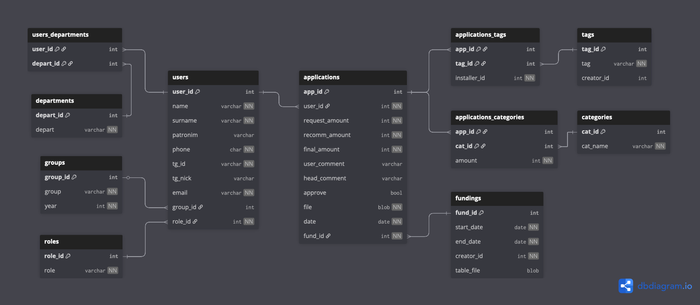

# Сервис сбора материальной помощи

## 💸 Описание и роли

Web-сервис для организации сбора материальной помощи студентам.
Существуют возможности открывать сборы, подавать заявления, обрабатывать их. Присутствует разделение на роли (студент, глава департамента, староста и начальник курса, стип. комиссия) со своими привилегиями и правами.
Авторизация осуществляется через учебную почту _@phystech.edu_.

> Между ролями существует иерархия: **Студент** -> **Глава департамента**, **Староста/Начальник курса** -> **Стипендиальная комиссия**. 
> Каждая последующая ступень иерархии наследует права предшествующей!

1. **Студент** может:
- подавать заявление на матпомощь
  - выбирать категории
  - запрашивать суммы по ним
  - оставлять комментарий к своему заявлению
  - загружать файл самого заявления
- минимально менять свой профиль
  - номер телефона
  - Telegram

**ФИО**, **почта** и **группа** подгружаются **стип. комиссией**.
**Роль** устанавливается **стип. комиссией** индивидуально.

> Заявления **Студента** обрабатываются **Старостой** его курса.
> Если **Студент** состоит в каких-то департаментах, то он имеет право подавать заявления на активизм в данные департаменты. Такие заявления обрабатывает **Глава** соответствующего департамента.
> Для каждого департамента его **Главой** открывается отдельный сбор.

2. **Глава департамента** может:
- добавлять студентов в свой департамент
- обрабатывать заявления студентов из своего департамента
  - ставить рекомендуемую сумму
  - оставлять свой комментарий к заявлениям
  - ставить теги к заявлениям
- создавать свои теги
- открывать сбор заявлений

> **Глава департамента** - человек, ответственный за департамент, в котором _он находится_.
> **Главе** можно состоять только в том департаменте, в котором он является главой.
> **Глава** может подавать заявления на активизм в любой департамент.

3. **Староста и/или начальник курса** может:
- менять курс и группу студента
- обрабатывать заявления студентов со своего курса
  - ставить рекомендуемую сумму
  - оставлять свой комментарий к заявлениям
  - ставить теги к заявлениям
- создавать свои теги
- открывать сбор заявлений

> **Староста курса** - человек, ответственный _только_ за курс, на котором он учится.
> **Начальник курса** - староста _не только своего_, но и _1 курса_.

4. **Стипендиальная комиссия** может:
- менять любую информацию о студенте
- добавлять новые группы
- создавать новые департаменты
- создавать новые категории
- обрабатывать все заявления студентов
  - ставить финальную сумму
  - одобрять заявления

> **Стипендиальная комиссия** - группа людей, выносящая окончательный вердикт по сбору матпомощи.

## 🗃️ ER-Диаграмма

[🔗](https://dbdiagram.io/d/fin_aid-68e29055d2b621e42255f8e5)

## 📊 Структура базы данных

### `users`

| Поле        | Тип данных    | Ограничения                   | Описание              |
|-------------|---------------|-------------------------------|-----------------------|
| `user_id`   | `INT`         | `PRIMARY KEY, AUTO_INCREMENT` | ID пользователя       |
| `name`      | `VARCHAR(30)` | `NOT NULL`                    | Имя пользователя      |
| `surname`   | `VARCHAR(30)` | `NOT NULL`                    | Фамилия пользователя  |
| `patronim`  | `VARCHAR(30)` |                               | Отчество пользователя |
| `phone`     | `CHAR(18)`    | `NOT NULL`                    | Номер телефона        |
| `tg_id`     | `VARCHAR(12)` | `NOT NULL, UNIQUE`            | Telegram ID           |
| `tg_nick`   | `VARCHAR(64)` | `UNIQUE`                      | Telegram nickname     |
| `email`     | `VARCHAR(48)` | `NOT NULL, UNIQUE`            | Учебная почта         |
| `group_id`  | `INT`         |                               | ID группы             |
| `role_id`   | `INT`         | `NOT NULL, DEFAULT 1`         | ID роли               |
| `is_active` | `BOOL`        | `NOT NULL, DEFAULT True`      | Учится ли студент     |

### `groups`

| Поле | Тип данных | Ограничения | Описание |
|------|------------|------------|-----------|
| `group_id` | `INT` | `PRIMARY KEY` | ID группы |
| `group` | `VARCHAR(10)` | `NOT NULL` | Номер группы |
| `year` | `INT` | `NOT NULL` | Год поступления потока |

### `roles`

| Поле | Тип данных    | Ограничения | Описание |
|------|---------------|-------------|-----------|
| `role_id` | `INT`         | `PRIMARY KEY` | ID роли |
| `role` | `VARCHAR(30)` | `NOT NULL, UNIQUE` | Название роли |

Возможные значения:
- 1: студент
- 2: глава департамента
- 3: староста курса
- 4: начальник курса (староста своего курса и 1-го курса)
- 5: стипендиальная комиссия

### `departments`

| Поле | Тип данных | Ограничения | Описание |
|------|------------|-------------|-----------|
| `depart_id` | `INT` | `PRIMARY KEY` | ID департамента |
| `depart` | `VARCHAR(50)` | `NOT NULL, UNIQUE` | Название департамента |

Возможные значения:
- 1: учебный департамент
- 2: информационный департамент
- 3: PR-департамент
- 4: хозяйственный департамент
- 5: ДКС (департамент культуры и спорта)

#### `users_departments`
(для связи таблиц `users` и `departments` "многие ко многим")

| Поле | Тип данных | Ограничения | Описание |
|------|------------|-------------|-----------|
| `user_id` | `INT` | `PRIMARY KEY` | ID пользователя |
| `depart_id` | `INT` | `PRIMARY KEY` | ID департамента |

---

### `applications`

| Поле | Тип данных | Ограничения | Описание |
|------|------------|-------------|-----------|
| `app_id` | `INT` | `PRIMARY KEY, AUTO_INCREMENT` | ID заявления |
| `user_id` | `INT` | `NOT_NULL` | ID пользователя |
| `request_amount` | `INT` | `NOT NULL, DEFAULT 0, CHECK (>= 0)` | Запрашиваемая сумма |
| `recomm_amount` | `INT` | `NOT NULL, CHECK (>= 0)` | Рекомендуемая сумма от старосты/главы |
| `final_amount` | `INT` | `NOT NULL, CHECK (>= 0)` | Итоговая сумма от комиссии |
| `user_comment` | `VARCHAR(100)` | `DEFAULT ""` | Комментарий пользователя |
| `head_comment` | `VARCHAR(100)` | `DEFAULT ""` | Комментарий старосты/главы |
| `approve` | `BOOL` | `DEFAULT False` | Одобрение заявления комиссией |
| `file` | `BLOB` | `NOT NULL` | Путь к файлу с заявлением |
| `date` | `DATE` | `NOT NULL, DEFAULT DATE('now')` | Дата подачи заявления |
| `fund_id` | `INT` | `NOT NULL` | ID сбора |

### `categories`

| Поле | Тип данных | Ограничения | Описание |
|------|------------|-------------|-----------|
| `cat_id` | `INT` | `PRIMARY KEY, AUTO_INCREMENT` | ID категории |
| `cat_name` | `VARCHAR(30)` | `NOT NULL, UNIQUE` | Название категории |

#### `applications_categories`
(для связи таблиц `applications` и `categories` "многие ко многим")

| Поле | Тип данных | Ограничения | Описание |
|------|------------|-------------|-----------|
| `app_id` | `INT` | `PRIMARY KEY, AUTO_INCREMENT` | ID заявления |
| `cat_id` | `INT` | `PRIMARY KEY` | ID категории |
| `amount` | `INT` | `NOT NULL, DEFAULT 0, CHECK (>= 0)` | Запрашиваемая сумма по категории |

### `tags`

| Поле | Тип данных | Ограничения | Описание |
|------|------------|-------------|-----------|
| `tag_id` | `INT` | `PRIMARY KEY, AUTO_INCREMENT` | ID тега |
| `tag` | `VARCHAR(30)` | `NOT NULL, UNIQUE` | Название категории |
| `creator_id` | `INT` |  | ID создателя метки |

#### `applications_tags`
(для связи таблиц `applications` и `tags` "многие ко многим")

| Поле | Тип данных | Ограничения | Описание |
|------|------------|-------------|-----------|
| `app_id` | `INT` | `PRIMARY KEY, AUTO_INCREMENT` | ID заявления |
| `tag_id` | `INT` | `PRIMARY KEY` | ID тега |
| `installer_id` | `INT` | `NOT NULL` | ID установившего метку |

---

### `fundings`

| Поле | Тип данных | Ограничения | Описание |
|------|------------|-------------|-----------|
| `fund_id` | `INT` | `PRIMARY KEY, AUTO_INCREMENT` | ID сбора |
| `start_date` | `DATE` | `NOT NULL, DEFAULT DATE('now')` | Дата начала сбора |
| `end_date` | `DATE` | `NOT NULL, DEFAULT DATE('now', '+5 days'), CHECK (> start_date)` | Дата конца сбора |
| `creator_id` | `INT` | `NOT NULL` | ID создавшего сбор |
| `table_file` | `BLOB` |  | Путь к таблице с заявлениями |

<!--

## ⚖️ Права

<table>
  <thead>
    <tr>
      <td><b>Роль</b></td>
      <td><b><code>users</code></b></td>
      <td><b><code>groups</code></b></td>
      <td><b><code>roles</code></b></td>
      <td><b><code>departments</code></b></td>
      <td><b><code>users_departments</code></b></td>
      <td><b><code>applications</code></b></td>
      <td><b><code>applications_tags</code></b></td>
      <td><b><code>tags</code></b></td>
      <td><b><code>applications_categories</code></b></td>
      <td><b><code>categories</code></b></td>
      <td><b><code>fundings</code></b></td>
    </tr>
  </thead>
  <tbody>
    <tr>
      <td> Студент </td>
      <td> 
        <b>W</b>:
        <ul>
          <li><code>tg_nick</code></li>
          <li><code>phone</code></li>
        </ul>
        <b>R</b>:
        <ul>
          <li><code>name</code></li>
          <li><code>surname</code></li>
          <li><code>patronim</code></li>
          <li><code>email</code></li>
        </ul>
      </td>
      <td>
        <b>R</b>:
        <ul>
          <li><code>group</code></li>
          <li><code>year</code></li>
        </ul>
      </td>
      <td></td>
      <td></td>
      <td>
        <b>R</b>:
        <ul>
          <li>Принадлежность себя к департаментам</li>
        </ul>
      </td>
      <td>
        <b>W</b>:
        <ul>
          <li><code>request_amount</code></li>
          <li><code>user_comment</code></li>
          <li><code>file</code></li>
        </ul>
        <b>R</b>:
        <ul>
          <li><code>final_amount</code></li>
          <li><code>approve</code></li>
        </ul>
      </td>
      <td>
        <b>R</b>:
        <ul>
          <li>Принадлежность тегов к своей анкете</li>
        </ul>
      </td>
      <td></td>
      <td>
        <b>W</b>:
        <ul>
          <li><code>amount</code></li>
        </ul>
      </td>
      <td>
        <b>R</b>:
        <ul>
          <li><code>cat_name</code></li>
        </ul>
      </td>
      <td>
        <b>R</b>:
        <ul>
          <li><code>start_date</code></li>
          <li><code>end_date</code></li>
          <li><code>creator_id</code> -> <code>year</code>, <code>name</code></li>
        </ul>
      </td>
    </tr>

    <tr>
      <td> Глава департамента </td>
      <td> 
        <b>W</b>:
        <ul>
          <li><code>tg_nick</code></li>
          <li><code>phone</code></li>
        </ul>
        <b>R</b>:
        <ul>
          <li><code>name</code></li>
          <li><code>surname</code></li>
          <li><code>patronim</code></li>
          <li><code>email</code></li>
        </ul>
      </td>
      <td>
        <b>R</b>:
        <ul>
          <li><code>group</code></li>
          <li><code>year</code></li>
        </ul>
      </td>
      <td></td>
      <td></td>
      <td>
        <b>R</b>:
        <ul>
          <li>Принадлежность себя к департаментам</li>
        </ul>
      </td>
      <td>
        <b>W</b>:
        <ul>
          <li><code>request_amount</code></li>
          <li><code>user_comment</code></li>
          <li><code>file</code></li>
        </ul>
        <b>R</b>:
        <ul>
          <li><code>final_amount</code></li>
          <li><code>approve</code></li>
        </ul>
      </td>
      <td>
        <b>R</b>:
        <ul>
          <li>Принадлежность тегов к своей анкете</li>
        </ul>
      </td>
      <td></td>
      <td>
        <b>W</b>:
        <ul>
          <li><code>amount</code></li>
        </ul>
      </td>
      <td>
        <b>R</b>:
        <ul>
          <li><code>cat_name</code></li>
        </ul>
      </td>
      <td>
        <b>R</b>:
        <ul>
          <li><code>start_date</code></li>
          <li><code>end_date</code></li>
          <li><code>creator_id</code> -> <code>year</code>, <code>name</code></li>
        </ul>
      </td>
    </tr>
  </tbody>
</table>

| Роль | `users` | `groups` | `roles` | `departments` | `users_departments` | `applications` | `applications_tags` | `tags` | `applications_categories` | `categories` | `fundings` |
|----|---------|----------|---------|---------------|---------------------|----------------|---------------------|--------|---------------------------|--------------|------------|
| Студент | **W**:<ul><li>`tg_nick`</li><li>`phone`</li></ul> **R**:<ul><li>`name`</li><li>`surname`</li><li>`patronim`</li><li>`email`</li></ul> |----------|---------|---------------|---------------------|----------------|---------------------|--------|---------------------------|--------------|------------|

### Студент

#### `users`

Может менять:
- `tg_nick`
- `phone`

Может видеть:
- `name`
- `surname`
- `patronim`
- `email`

#### `groups`

Может видеть:
- `group` (<- `group_id`)
- `year` (<- `group_id`)

#### `departments`

Может видеть:
- `depart` (<- `depart_id`, `user_id`)

#### `applications`

Может менять:
- `request_amount`
- `user_comment`
- `file`

Может видеть:
- `final_amount`
- `approve`

#### `applications`

Может менять:
- `request_amount`
- `user_comment`
- `file`

Может видеть:
- `final_amount`
- `approve`
-->
